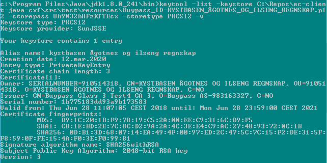
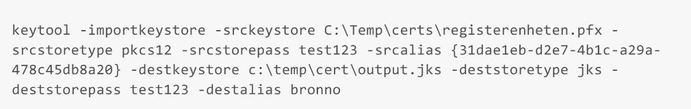

# Javaklient for Altinns webservicer. Utviklet for formidlingstjenestene

### Referanser

|Nr|Dokumentnavn|Forklaring|
|--|--------|---|
|1|https://altinn.github.io/docs/api/datasystem/ |Implementasjonsguide for sluttbrukersystemer|
|2|https://altinn.github.io/docs/api/tjenesteeiere      |Implementasjonsguide for tjenesteeier|

### Definisjoner

|Betegnelse|Beskrivelse|
|----------|-----------|
|Avgiver|Rolle i forbindelse med formidlingstjenesten: Den person eller virksomhet (offentlig eller privat) som avgir informasjon til formidlingstjenesten.|
|Mottaker|Rolle i forbindelse med formidlingstjenesten: Den person eller virksomhet (offentlig eller privat) som mottar informasjon fra formidlingstjenesten.|
|Tjenesteeier|Rolle i forbindelse med formidlingstjenesten: Den offentlige virksomhet som er ansvarlig for en formidlingstjeneste og gir tilganger til avgivere og mottakere.|
|Reportee|Ved instansiering og opplasting til formidlingstjenesten settes det til avgiver. Ved søking etter tilgjengelige formidlinger settes det til mottaker.|
|Receipt|Kvittering. Altinn ivaretar kvittering for hver formidling gjennom formidlingstjenesten. Dette gir sporbarhet for både avgiver, mottaker og tjenesteeier. Kvitteringer slettes ikke fra Altinn selv om øvrige formidlingsdata kan være slettet ved at formidling er fullført. Kvitteringene kan oppdateres i ettertid av både avgiver og mottaker.|
|SRR|Det tjenesteeierstyrte rettighetsregisteret. Dette register kan brukes til å bestemme for hver formidlingstjeneste hvilke enheter angitt ved personnummer/organisasjonsnummer som har lese/skrive (motta/avgi) rettigheter.|
|payload|Essensen av en formidling bestående av en komprimert datafil (zip-fil) som skal formidles fra avgiver til mottaker. Bortsett fra å oppdatere manifestet, gjør Altinn ingen endring eller validering av innholdet i filen utenom en virusskanning.|

## Innledning
Dette er dokumentasjon for en Java referanseklient som integrerer med Altinn formidlingstjenesten. Formidlingstjenesten er tilgjengelig som et sett av webservicer. Java klienten har til hensikt å gi et enkelt eksempel på hvordan integrasjon mellom et sluttbrukersystem og Altinn formidlingstjenesten kan gjøres. Siden fokus er på bruk av Altinn webservices søkes det å unngå bruk av tredjeparts bibliotek og rammeverk som ikke er direkte relevant for integrasjonen. Det legges dessuten vekt på å gi informasjon av teknisk karakter som kan være av verdi for en utvikler av sluttbrukersystem som skal integreres mot Altinn sin webservice.

Altinn formidlingstjenesten har i likhet med øvrige webservices som Altinn tilbyr, 3 ulike nivå sikkerhet (ref /1/ avsnitt 5.1 og 8.3):
1. **Basic** (SOAP 1.1) Tradisjonell web service
2. **WS-Security** (SOAP 1.2 med WS-Security username token) Støtte for nye web service standarder WS*.
3. **Enterprise Certificate** (SOAP 1.2 med WS-Security X.509 token) Støtte for nye web standarder WS*. Sertifikat ligger i SOAP headeren mens brukernavn og passord ligger i meldingen.

I dette dokumentet beskrives integrasjon mot Altinn webservice basert på det høyeste sikkerhetsnivå: nivå 3 Enterprise Certificate.

Selv om det er formidlingstjenestene som er hovedfokus for denne klienten, har vi utvidet klienten med metoder for å sende inn innsendingstjenester til Altinn. Årsaken er at klienten da kan benyttes som eksempel for dem som utvikler i Java. 

### EC2-oppdatering
Våren 2020 ble Java referanseklienten oppdatert til å støtte nye EC2-endepunkter. I store trekk ble følgende endringer gjort:
1) Endepunktsadressene ble oppdatert til å gå mot nye EC2-endepunkt.
2) Alle klasser, variabler, metoder og filer med "EC" i navnet fikk erstattet "EC" med "EC2" i navnet.
3) Metoden BrokerEC2Client.downloadFile returnerer ikke lenger type DataHandler, men byte[]. Koden er endret for å håndtere dette.
4) Alle wsdl-er oppdatert med nye tilsvarende wsdl-er fra EC2-endepunkt.
5) Nødvendige modifikasjoner er gjort på wsdl-er for å få konvertering fra wsdl til javaklasser til å fungere.
6) Wsdl-en IntermediaryInboudExternalEC2.wsdl er slettet da det kun er IntermediaryInboudExternalEC2Single.wsdl som brukes.
7) Wsdl for ReceiptExternal bruker nå ReceiptExternalEC2Single.wsdl da dette var nødvendig for få modifisert riktig del av wsdl-en.
8) Versjon av cxf er oppdatert i .pom-fil til å være versjon 3.3.5 som støtter EC2 og TLS1.2.

## Teknisk guide
Under følger en oversikt over de tekniske avhengighetene som må være på plass for å kunne få satt opp Java referanseklienten. Det anbefales å lese gjennom hele guiden grundig, før man går i gang med implementasjon. 
### Java Cryptography Extension
Altinn bruker en type kryptering som går ut over det som standard Java installasjon tilbyr. Det er derfor nødvendig å laste ned en utvidelse til Java installasjonen som gjør det mulig med ubegrenset styrke på kryptering. Avhengig av Java versjon kan den nødvendige utvidelse lastes ned fra www.oracle.com:

* Java Cryptography Extension (JCE) Unlimited Strength Jurisdiction Policy Files 6
* Java Cryptography Extension (JCE) Unlimited Strength Jurisdiction Policy Files 7 Download
* Java Cryptography Extension (JCE) Unlimited Strength Jurisdiction Policy Files 8 Download

Nedlastingen er en zip fil som inneholder to jar filer, local_policy.jar og US_export_policy.jar. Disse må erstatte tilsvarende filer i lib\security\policy\unlimited katalogen for **både** JRE og JDK katalogen, for eksempel:

* C:\Program Files\Java\jdk1.8.0_121\jre\lib\security\policy\unlimited
* C:\Program Files\Java\jre1.8.0_121\lib\security\policy\unlimited

### Enterprise Certificate
Gitt nivå 3 for sikkerhet er det en forutsetning for tilgang til Altinn formidlingstjenesten at man har et "Enterprise Certificate" for virksomheten. Dette kan for eksempel være utgitt av Commfides eller BuyPass. I denne referanseklienten er det tatt utgangspunkt i sertifikat på format pkcs12 (file suffix *.p12). 

Man har tidligere hatt trøbbel med bruk av ÆØÅ i aliasene/filnavnene til sertifikatene, men etter oppsett med cxf versjon 3.3.5, ser dette nå ut til å fungere. Det kan likevel være greit å være obs på hvis man får problemer med sertifikatene. 

#### Teste og endre sertifikater
Det kan være litt utfordrende å få importert sertifikatene og få dem til å fungere riktig mot klienten. Typiske utfordringer er at sertifikatene er ugyldige, eller navneproblemer som problemet med ÆØÅ nevnt over. Av spesiell interesse er attributtene _valid from_, _valid to_ og _friendly name_. Med en sertifikatfil og tilhørende passord kan man bruke flere verktøy til å bekrefte at sertifikatet er gyldig eller endre på deler av sertifikatet.     

Følgende kommando kan for eksempel brukes for å sjekke om sertifikatet er gyldig. Java keytool verktøyet finnes under "%JAVA_HOME\bin%":



Java keytool kan også brukes til å omskrive et sertifikat fra en form til en annen. For eksempel sette eller endre _friendly name_ (aka. alias):



En annen mulighet er å importere sertifikatet på lokal Windows PC, og gjøre endringene derfra. Gjør da følgende:
1) Åpne Microsoft management console __mmc__. I mmc, velg _File_->_add/remove snap ins_.
2) Finn _Certificates_ i lista og velg _My user account_. Trykk _finish_ og _OK_ for å legge til.
3) Du vil nå få en mappe til venstre som heter _Certificates_. For å importere nytt sertifikat, høyreklikk på _Personal_ (under _Certificates_-mappa)->_All tasks_->_Import_.
4) I importguiden velg store location _Local machine_ og trykk neste. Last så opp ønsket sertifikat. 
5) Trykk _next_ og skriv inn sertifikatets passord. Huk av for _Include all extended properties_. 
6) På neste side velger du _Automatically select the certificate stored(...)_. Trykk _Finish_.
7) Sertifikatet legges nå til under _Personal_-mappa. Ved å trykke på _Certificates_ under _Personal_ får man opp en oversikt over alle sertifikatene man har lagt til. Her kan man lese ut _Friendly Name_ og _Expiration date_.
8) Ved å dobbeltklikke på ønsket sertifikat og velge _Details_ kan man endre og lese ut noen av egenskapene, som f.eks _Friendly Name_.  
 
__Merk__: For å få testene i javaklienten til å fungere, må de importerte sertifikatenes egenskaper matche egenskaper for avgiver og mottaker som er satt opp i konfigurasjonsfilene i javaklienten, under _test\resources\properties_. Et eksempel her er "Friendly Name" som tilsvarer "alias" i konfigurasjonsfilen. 
 
### SoapUI
Under arbeid med en ny integrasjon mot Altinn formidlingstjenesten kan det være et nyttig første steg å gjøre noen enklere tester for å se at man oppnår kontakt med tjenesten og at den tildelte testbruker har de nødvendige tilganger til den formidlingstjenesten man skal bruke. Til dette formål kan verktøyet [SoapUI](https://www.soapui.org/) brukes. Gratisversjonen av SoapUI er tilstrekkelig i denne sammenheng.

Til et slikt første steg bruker man da Altinn tjenestene på sikkerhetsnivå *basic*. Man oppretter et nytt prosjekt i SoapUI og starter med å importere wsdl filen for en av tjenestene, ref. /1/ avsnitt 8.3 og etterfølgende oversikt over aktuelle tjenester og wsdl filer. For enkelhets skyld, her er lenker til de relevante wsdl filer for bruk med SoapUI:

- https://tt02.altinn.no/ServiceEngineExternal/BrokerServiceExternalBasic.svc?wsdl
- https://tt02.altinn.no/ServiceEngineExternal/BrokerServiceExternalStreamedBasic.svc?wsdl
- https://tt02.altinn.no/IntermediaryExternal/ReceiptExternalBasic.svc?wsdl

Det er viktig å være oppmerksom på at etter import av wsdl fil til sitt SoapUI prosjekt så må URI for hvert service endpoint endres. Man må huske å endre fra **http** til **https**. Av tekniske grunner knyttet til Altinn infrastruktur (load balancing) vil hver wsdl angi service endpoint med feil protokoll.

Vi gjør oppmerksom på at de ulike tjenestene i Altinn har forskjellige sikkerhetsnivåer. For eksempel kan det til en spesiell innsendingstjeneste være tilstrekkelig å logge inn med passord, mens det for en annen meldingstjeneste er påkrevd med autentisering på linje med BankId. Vi har ennå ikke lyktes med å benytte SoapUI med virksomhetssertifikater, så her kan det by på en utfordring å få testet "sin" formidlingstjeneste med SoapUI siden den krever sikkerhetsnivå 3.  

Her er et eksempel på bruk av SoapUI mot Altinn webservice:


### Webservice oversikt

Dokumentet /1/ gir en oversikt over alle Altinn webservices som er tilgjengelige for integrasjon med sluttbrukersystemer. Et subsett av disse webservices er relevante for bruk med Altinn formidlingstjenesten. 

For formidlingstjenesten er det først og fremst webservices som er beskrevet i /1/ avsnitt 6.14:

|Webservice|Beskrivelse|
|----------|-----------|
|BrokerServiceExternalEC2.InitiateBrokerService|Initialisering av formidlingstjenesten.|
|BrokerServiceExternalEC2.GetAvailableFiles|Hent ut tilgjengelige filer fra formidlingstjenesten.|
|BrokerServiceExternalEC2.ConfirmDownloaded|Bekrefte at fil er nedlastet fullstendig.|
|BrokerServiceExternalEC2Streamed.UploadFileStreamed|Opplasting av filer til formidlingstjenesten.|
|BrokerServiceExternalEC2Streamed.DownloadFileStreamed|Nedlasting av filer fra formidlingstjenesten.|

I tillegg er følgende webservices relevant for å hente ut eller oppdatere kvittering fra formidlingstjenesten. Beskrevet i /1/ avsnitt 6.4:

|Webservice|Beskrivelse|
|----------|-----------|
|ReceiptExternalEC2.GetReceiptV2|Hente kvittering fra formidlingstjenesten.|
|ReceiptExternalEC2.GetReceiptListV2|Hente alle kvitteringer tilhørende en kvitteringstype og/eller fra et gitt tidsrom|
|ReceiptExternalEC2.UpdateReceipt|Oppdatere en kvittering, for eksempel ved mottak av data fra formidlingstjenesten.|

I tillegg til formidlingstjenester, er klienten utvidet med kall for å hente meldinger (Correspondence) fra Altinn og sende inn innsendingstjenester (skjemaer) til Altinn. Til dette benyttes følgende webservicer:

|Webservice|Beskrivelse|
|----------|-----------|
|ReporteeElementListEC2.GetReporteeElementListEC|Henter en liste med elementer fra arbeidsliste og arkiv.|
|CorrespondenceExternalEC2.GetCorrespondenceForEndUserSystemsEC|Hente detaljer for en spesifikk melding|
|IntermediaryInboundExternalEC2.SubmitFormTaskEC|Sende et skjemasett til Altinn|


### WSDL filer

Wsdl for de nevnte tjenester er tilgjengelig på følgende URI:

- https://tt02.altinn.no/ServiceEngineExternal/BrokerServiceExternalEC2.svc?wsdl
- https://tt02.altinn.no/ServiceEngineExternal/BrokerServiceExternalEC2Streamed.svc?wsdl
- https://tt02.altinn.no/IntermediaryExternal/ReceiptExternalEC2.svc?wsdl
- https://tt02.altinn.no/ServiceEngineExternal/ReporteeElementListEC2.svc
- https://tt02.altinn.no/ServiceEngineExternal/CorrespondenceExternalEC2.svc
- https://tt02.altinn.no/IntermediaryExternal/IntermediaryInboundExternalEC2.svc

De angitte adresser er til Altinn testmiljø tt02. For produksjon byttes tt02.altinn.no med www.altinn.no.

Altinn webservices er utviklet med Microsoft .Net teknologi. Ved arbeid med Java klient mot disse webservices er det avdekket noen tekniske problemer som kan omgås ved å modifisere wsdl filen for Altinn tjenester. Den medfølgende Java referanseklienten har derfor kopier av Altinn wsdl filer med noen mindre endringer.

Endringene som er gjort på wsdl-ene går i hovedsak på å kommentere ut deler av wsdl-en som har gitt konflikt i konverteringen. For eksempel opplevde man en konflikt med hvordan WS-SecurityPolicy «HttpToken» ble håndtert. Dersom man kommenterer ut «HttpToken» i wsdl-ene som brukes i klienten , fungerer likevel integrasjonen tilsynelatende fint, og konklusjonen er derfor at dette elementet ikke har noen praktisk effekt, og derfor kan kommenteres ut uten å begrense funksjonaliteten. 

Under arbeid med apache-cxf klienten var det også nødvendig å redigere wsdl-filen for tjenesten ReceiptExternalEC2 fordi verktøyet wsdl2java ga feilmelding "Two declarations cause a collision in the ObjectFactory class." De duplikate deklarasjonene ble da utkommentert.

Tidligere har man også hatt problemer med WS-SecurityPolicy "RequireDerivedKeys", men siden de nye EC2 wsdl-ene ikke er satt opp med denne policyen, er dette ikke lenger et problem.    

Det er ikke ønskelig å måtte gjøre de beskrevne tilpasninger av wsdl-filene for å få Java klienten til å fungere, men inntil de tekniske forskjellene mellom .Net og Java blir rettet opp i eventuelle fremtidige versjoner av rammeverkene, er det dessverre nødvendig.

## Bruk av formidlingstjenesten
Tjenestene som inngår i formidlingstjenesten brukes i en bestemt rekkefølge for både avgiver og mottaker. Dette kan illustreres med et sekvensdiagram som følger:


Med henvisning til nummerering i sekvensdiagrammet ovenfor så skjer følgende:

#### 1. InitiateBrokerService
Kallet til tjenesten InitiateBrokerService tar et *Manifest* og en liste av mottakere som parameter. Ref. /1/ avsnitt 6.14.2 så inneholder et manifest:
- ServiceCode+ServiceEditionCode, angir hvilken formidlingstjeneste som skal brukes
- SendersReference, en unik referanse for avgiver
- Reportee, avgiver sitt organisasjonsnummer/fødselsnummer
- FileList, hvilke filer som er inkludert
- PropertyList, en liste av properties, nøkkel og verdi, etter avtale mellom avgiver og mottaker

#### 2. Formidlingsreferanse
Formidlingstjenesten vil validere manifestet og dersom validering er ok så opprettes en formidling med en formidlingsreferanse som returneres. 

#### 3. UploadFileStreamed
Formidlingsreferansen må deretter brukes av avgiver ved opplasting av selve datafilen (payload) som skal formidles. Dette gjøres ved kall til tjenesten UploadFileStreamed.

#### 4. Kvittering
For hver formidling holder formidlingstjenesten en kvittering oppdatert, ref. /1/ avsnitt 6.4.1. En kvittering er en datastruktur med en hovedkvittering og liste av underkvitteringer. En underkvittering kan igjen holde en liste av underkvitteringer. Tjenesten UploadFileStreamed oppretter en *hovedkvittering* med en *underkvittering* for hver angitt mottaker. Avgiver får tilbake *hovedkvittering*. Mottakere oppdaterer hver sin egen underkvittering. Enhver oppdatering av en kvittering eller underkvittering vil kun akkumulere informasjon. Kvitteringer i Altinn slettes ikke.

#### 5. GetAvailableFiles
Kallet til tjenesten GetAvailableFiles tar et sett med søkekriterier som parameter, ref. /1/ avsnitt 6.14.1:
- ServiceCode+ServiceEditionCode, angir hvilken formidlingstjeneste det gjelder
- Reportee, mottaker sitt organisasjonsnummer/fødselsnummer
- FileStatus, om filen er *uploaded* (ikke lastet ned) eller *downloaded* (lastet ned men fortsatt tilgjengelig)
- MinSentDateTime, begrenser søket til filer sent etter gitt dato
- MaxSentDateTime, begrenser søket til filer sent før gitt dato

#### 6. Available file list
Tjenesten GetAvailableFiles returnerer en liste av BrokerServiceAvailableFile som er tilgjengelig for angitt mottaker.

#### 7. DownloadFileStreamed
Tjenesten DownloadFileStreamed kalles med enkeltvise referanser hentet fra listen som ble returnert fra kallet til GetAvailableFiles.

#### 8. Datastrøm
Tjenesten DownloadFileStreamed returnerer en datastrøm som kan lagres på fil hos mottaker.

#### 9. UpdateReceipt
Dersom filen lastes ned og verifiseres ok av mottaker så er det mulig for mottaker å meddele avsender status ved å kalle tjenesten UpdateReceipt. Dette steg kan også gjøres etter ConfirmDowloaded hvis ønskelig. 

Hver mottaker av en gitt formidling har sin egen underkvittering tilknyttet hovedkvitteringen som ble opprettet da formidling ble instansiert. UpdateReceipt kallet skal da bruke ReceiptID hentet fra listen returnert fra GetAvailableFiles. Denne ReceiptID tilhører mottakers underkvittering.

Kallet til tjenesten UpdateReceipt tar parametere som følger, ref. /1/ avsnitt 6.4.3:
- ReceiptId, unik identifikator for kvittering
- ArchiveReference, hvis det finnes flere kvitteringer med samme arkivreferanse så vil den nyeste bli valgt
- ReceiptText, oppdateringstekst for kvittering
- ReceiptStatus, Status for forsendelse som kvitteringen gjelder: OK, UnExpectedError, ValidationFailed, Rejected
- References, liste med referanser man ønsker legge til, bør begrenses til ReceiversReference
- SubReceipts, liste med barnekvitteringer som også ønskes oppdatert i tillegg til hovedkvitteringen. Barnekvitteringer MÅ identifiseres med ReceiptId. Dette kan ikke benyttes til å lage nye barnekvitteringer.

#### 10. Kvittering
Kallet til UpdateReceipt vil returnere mottakers underkvittering med oppdateringen.

#### 11. ConfirmDownloaded
Det avsluttende steg for mottaker er å kalle tjenesten ConfirmDownloaded med den samme filreferanse som brukt i kallet til tjenesten DownloadFileStreamed. Tjenesten benyttes til å bekrefte at man har fått lastet ned en formidlingsfil i sin helhet. Resultatet er at avsender kan se hvem av filens mottakere som har fått hentet filen. Når alle mottakere av en formidling har kalt ConfirmDownloaded for å bekrefte at data er mottatt så blir datafilen slettet fra Altinn server. Kallet til ConfirmDownloaded skal derfor ikke gjøres før man som mottaker har kontrollert at alle data er mottatt og verifisert ok.

#### 12. GetReceipt
Avgiver kan få vite status for sin formidling ved å kalle tjenesten GetReceipt. Underkvitteringer vil da vise status for hver mottaker hvorvidt disse har fått hentet sine filer.

#### 13. Kvittering
For avgiver returneres formidlingens hovedkvittering.


## Java referanseklient

#### Verktøy/teknologi
Java referanseklienten er basert på seneste versjon av [Apache CXF](http://cxf.apache.org/) rammeverket (versjon 3.3.5 eller nyere) som gir støtte for relevante standarder for integrasjon mot Altinn webservices. Programmeringsspråket er Java versjon 8, men det er ikke brukt noen nye Java features spesifikt for denne Java versjon i koden så eldre versjoner skulle også kunne brukes like godt.

Videre er følgende verktøy/teknologi brukt:
- Maven versjon 3, for bygging
- Spring-context, kjernedelen av spring for *dependency injection*
- Junit, for testing
- Hamcrest, for testing
- Spring-test, for testing
- IntelliJ IDEA Community edition, Java IDE

#### Generert kode
En viktig del av Apache CXF rammeverket er verktøyet *wsdl2java* som brukes til å generere javaklasser basert på wsdl filene for formidlingstjenesten. De genererte klasser kan etter bygging med maven finnes i katalogen /target/generated-sources under prosjektets rotkatalog. Følgende kommando vil bygge hele prosjektet, deriblant kjøre *wsdl2java*, men uten å kjøre noen tester:
```
mvn clean install -DskipTests
```
__NB!__ For å få satt opp klienten mot nye EC2-endepunkt, er det nødvendig med versjon 3.3.5 eller nyere av Apache CXF rammeverket.
#### Referanseklientens grensesnitt
I referanseklienten brukes ikke de automatisk genererte klasser direkte for tilgang til formidlingstjenesten, men isteden via klasser i pakken no.asf.formidling.client.ws.client. Klassen **BrokerEC2Client** i denne pakken danner et forenklet grensesnitt mot hele formidlingstjenesten og klassen **ReceiptEC2Client** et tilsvarende forenklet grensesnitt mot Altinn tjenester for kvitteringer. Pakken no.asf.formidling.client.vo inneholder *value objects* klasser som holder data som er input eller output til tjenestene i de to nevnte Client klasser. Det anbefales å se på javadoc dokumentasjonen for disse pakker.

#### Javadoc
Ved å kjøre følgende maven kommando fra prosjektets rotkatalog får man generert javadoc dokumentasjon for referanseklienten som etterpå kan finnes under katalogen /target/site/apidocs/index.html:
```
mvn javadoc:javadoc
```

#### Tester
Typisk bruk av de to sentrale klasser i referanseklienten er illustrert i testklasser som finnes i pakken no.asf.formidling.client.ws.client i katalogen /src/test/java. Referanseklienten har en testbruker for hver av rollene avgiver og mottaker og disse er beskrevet i properties filer i katalogen /src/test/resources/properties. 

Klassen **FormidlingAvgiverTest** tester opplasting av en fil til formidlingstjenesten. Ettersom initiateService og uploadFile alltid gjøres etter hverandre og returverdi fra den første er input til den neste så er dette forenklet med ett kall til metoden uploadFile i klassen BrokerEC2Client.

Klassen **FormidlingMottakerTest** tester alle stegene beskrevet ovenfor som utføres i sekvens av en mottaker av en formidling. Det innebærer kall til metoder i BrokerEC2Client og ReceiptEC2Client i riktig rekkefølge. Disse testene vil feile dersom det ikke finnes noen filer å hente ned så man bør eventuelt kjøre FormidlingAvgiverTest først.

Klassen **ReceiptEC2Test** tester kvitteringstjenestene for avgiver. Den bruker en fast kvitteringsid i testen og det burde virke ok ettersom kvitteringer i Altinn ikke slettes.

#### Konfigurasjon
Klassen **EC2ClientConfig** i pakken no.asf.formidling.client.config brukes som spring *ContextConfiguration*. Det betyr at den setter opp **spring context** ved oppstart av testene. Dette er angitt i toppen av testklassene med annotation:
```
@ContextConfiguration(classes = {EC2ClientConfig.class})
```
Alternativt kan tradisjonell xml basert spring konfigurasjon brukes (cxf.xml).

Under katalogen src/main/resources/properties finnes følgende xml konfigurasjonsfiler:
- formidling-tjeneste, Servicekode/versjon for formidlingstjenesten
- formidling-uri, URI adresser for Altinn webservices
- logging-properties, setter nivå på logging for rammeverk og klientkode

Tilsvarende under katalogen src/test/resoures/properties finnes følgende xml konfigurasjonsfiler:
- avgiver-properties, inneholder alle nødvendige data om formidlingens avgiver
- mottaker-properties, inneholder alle nødvendige data om formidlingens mottaker

#### Interceptors
En viktig del av spring konfigurasjon er instansiering av **Bus** hvor det settes opp webservice **interceptors** som er avgjørende for at kommunikasjonen med Altinn webservices skal fungere. Følgende *interceptors* registreres:
- CookiesInInterceptor, henter attributten *Set-Cookie* fra http header i inngående melding (RequestSecurityTokenResponse) fra webservice og lagrer i minnet (ThreadLocal, dvs. knyttet til en thread). 
- CookiesOutInterceptor, setter attributten *Cookie* i http header på utgående melding til webservice hvis den finnes i minnet.
- HeaderInterceptor, setter attributten *Connection* til verdi *Keep-Alive* i header på utgående melding til webservice.
- BadContextTokenInFaultInterceptor, håndterer feilmelding fra webservice av type *BadContextToken* og prøver rette opp.

I tillegg setter EC2ClientConfig opp *Bus* med logging av alle webserice meldinger (LoggingFeature prettyLogging=true). Følgende er et utsnitt fra loggen ved kjøring av test som viser at interceptors har lagt til headers attributtene *Connection Keep-Alive* og *Cookie*:
```
ID: 3
Address: https://tt02.altinn.no/ServiceEngineExternal/BrokerServiceExternalEC2Streamed.svc
Encoding: UTF-8
Http-Method: POST
Content-Type: application/soap+xml; action="http://schemas.xmlsoap.org/ws/2005/02/trust/RST/SCT"
Headers: {Accept=[*/*], Connection=[Keep-Alive], Cookie=[BIGipServerai2v2-tt02-intweb-80=139074058.20480.0000; path=/]}
Payload: <soap:Envelope xmlns:soap="http://www.w3.org/2003/05/soap-envelope">
```
Den samme *Cookie* brukes altså ved flere etterfølgende meldinger til webservice inntil en ny inngående melding med header attributten *Set-Cookie* dukker opp. Ettersom referanseklienten lagrer denne *Cookie* i minnet for en thread så kan det skape problemer å blande tjenestekall med flere virksomhetsbrukere i en og samme test. Et kall til Altinn webservice med ugyldig sikkerhetskonfigurasjon for en virksomhetsbruker vil føre til at denne bruker stenges ute fra Altinn i et visst tidsrom (1 time).